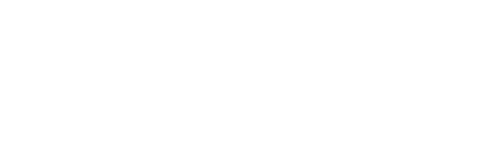

# Spellburn and Battlescars

  

  
  
  

#

[Spellburn and Battlescars](https://xenio-in-a-bottle.itch.io/sab) System for Foundry VTT.

Spellburn and Battlescars is created by [Xenio in a Bottle](https://xenio-in-a-bottle.itch.io/), and is licensed under [CC-BY-SA 4.0.](https://creativecommons.org/licenses/by-sa/4.0/)

Made using the [Boilerplate System](https://github.com/asacolips-projects/boilerplate) by asacolips.

Localized to Portuguese and English.
